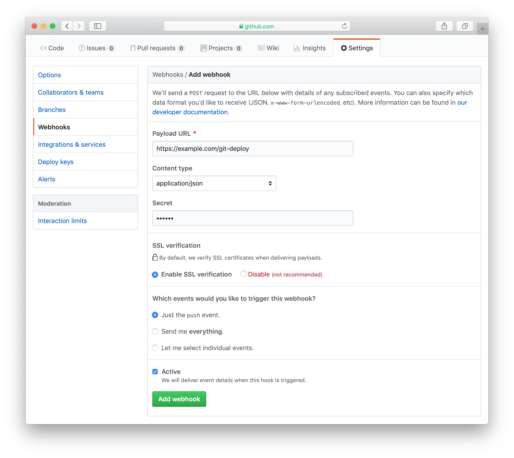
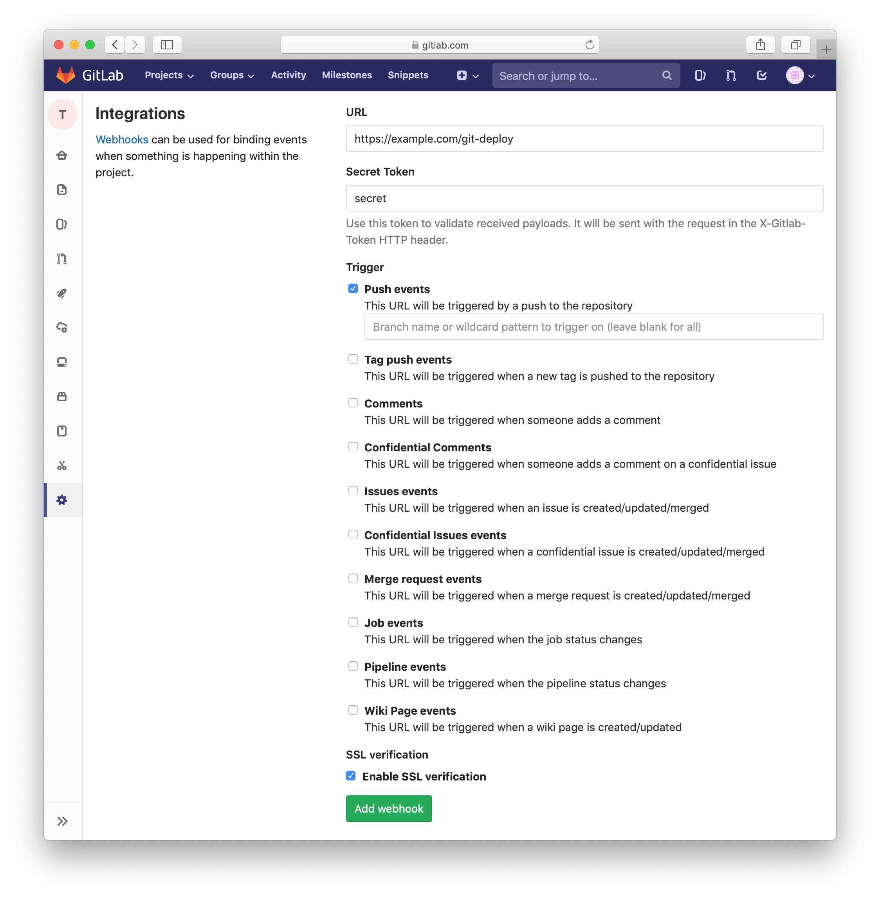
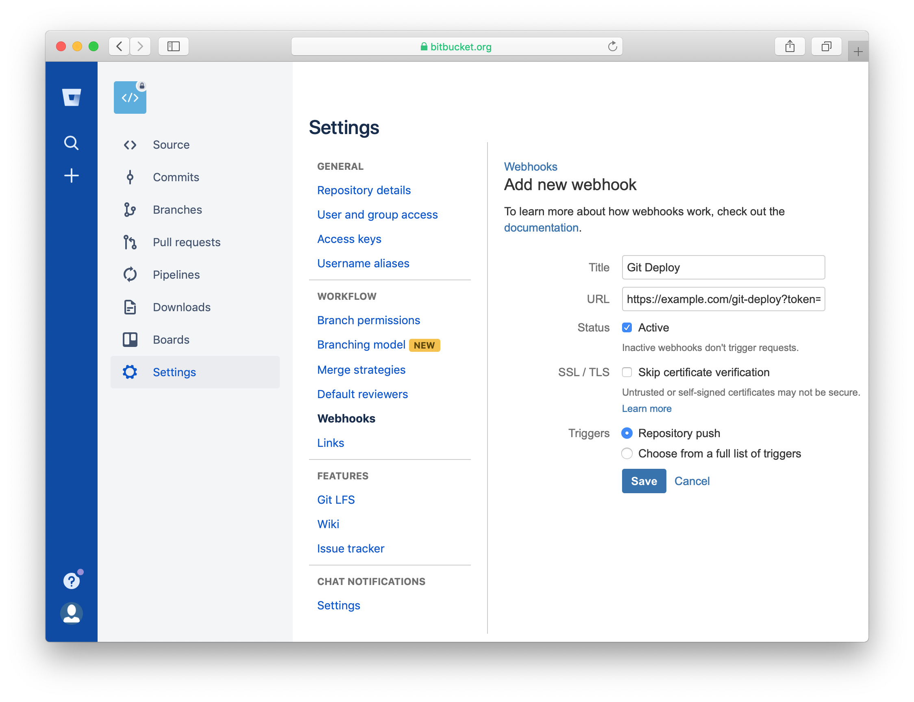

# GitDeploy plugin for CakePHP

Plugin to operate automatic git-pull server with CakePHP 3 (Using WebHook from GitHub, GitLab and Bitbucket)

## Requirements

* CakePHP 3.5 or later
* PHP 5.6 or later

## Installation

### 1. Install plugin

You can install this plugin into your CakePHP application using [composer](http://getcomposer.org).

The recommended way to install composer packages is:

```
composer require node-link/cakephp-git-deploy
```

### 2. Load plugin

Please load the plugin manually as follows:

```php
<?php
// In src/Application.php. Requires at least 3.6.0
use Cake\Http\BaseApplication;

class Application extends BaseApplication
{
    public function bootstrap()
    {
        parent::bootstrap();

        // Load the plugin
        $this->addPlugin('NodeLink/GitDeploy');
    }
}
```

Prior to 3.6.0, you should use `Plugin::load()`:

```php
<?php
// In config/bootstrap.php

use Cake\Core\Plugin;

Plugin::load('NodeLink/GitDeploy', ['bootstrap' => true, 'routes' => true]);
```

Or, use `bin/cake` to load the plugin as follows:

```bash
bin/cake plugin load -b -r NodeLink/GitDeploy
```

## Configuration

Edit `config/.env` or `config/app.php`.

The full default configuration is as follows:

```php
<?php
return [
    'GitDeploy' => [
        'enable' => filter_var(env('GIT_DEPLOY_ENABLE', false), FILTER_VALIDATE_BOOLEAN),
        'token' => env('GIT_DEPLOY_TOKEN', 'secret'),
        'branch' => env('GIT_DEPLOY_BRANCH', 'master'),
        'git_path' => env('GIT_DEPLOY_GIT_PATH', '/usr/bin/git'),
        'composer_path' => env('GIT_DEPLOY_COMPOSER_PATH', '/usr/local/bin/composer')
    ],
];
```

It is recommended to add following items to `config/.env`.

```bash
export GIT_DEPLOY_ENABLE="true"
export GIT_DEPLOY_TOKEN="__TOKEN__"
export GIT_DEPLOY_BRANCH="master"
export GIT_DEPLOY_GIT_PATH="/usr/bin/git"
export GIT_DEPLOY_COMPOSER_PATH="/usr/local/bin/composer"
export COMPOSER_HOME="/var/www"
```

It may not work unless `COMPOSER_HOME` is set correctly.

## Settings

### GitHub

In your repository, navigate to Settings &rarr; Webhooks &rarr; Add webhook, and use the following settings:

* Payload URL: https://example.com/git-deploy
* Content type: application/json
* Secret: The value of `GIT_DEPLOY_TOKEN` in `config/.env`
* Which events would you like to trigger this webhook?: :radio_button: Just the push event
* Active: :ballot_box_with_check:

Click "Add webhook" to save your settings, and the script should start working.



### GitLab

In your repository, navigate to Settings &rarr; Integrations, and use the following settings:

* URL: https://example.com/git-deploy
* Secret Token: The value of `GIT_DEPLOY_TOKEN` in `config/.env`
* Trigger: :ballot_box_with_check: Push events
* Enable SSL verification: :ballot_box_with_check: (only if using SSL, see [GitLab's documentation](https://gitlab.com/help/user/project/integrations/webhooks#ssl-verification) for more details)

Click "Add webhook" to save your settings, and the script should start working.



### Bitbucket

In your repository, navigate to Settings &rarr; Webhooks &rarr; Add webhook, and use the following settings:

* Title: Git Deploy
* URL: https://example.com/git-deploy?token= `GIT_DEPLOY_TOKEN`
* Active: :ballot_box_with_check:
* SSL / TLS: :white_large_square: Skip certificate verification (only if using SSL, see [Bitbucket's documentation](https://confluence.atlassian.com/bitbucket/manage-webhooks-735643732.html#ManageWebhooks-skip_certificate) for more details)
* Triggers: :radio_button: Repository push

Click "Save" to save your settings, and the script should start working.



## Trouble Shooting

If execution is not successful, please refer to `logs/error.log` and `logs/debug.log`.

Details of the error at the time of execution may be listed in some cases.

### Permissions

When it does not work well, in many cases, there is a problem with permissions.

Please set so that the web server user (`www`, `www-data`, `apache`, etc...) can `git pull` and `composer install`.

It is suggested this be accomplished by changing the repository group to the web server user's and giving the group write permissions:

1. Open a terminal to the directory containing the repository on the server.
2. run `sudo chown -R yourusername:webserverusername project-dir/` to change the group of the repo.
3. run `sudo chmod -R g+s project-dir/` to make the group assignment inherited for new files/dirs.
4. run `sudo chmod -R 775 project-dir/` to set read & write for both owner and group.

### SSH

Generate an SSH key and add it to your account so that git pull can be run without a password.

* [GitHub documentation](https://help.github.com/articles/connecting-to-github-with-ssh/)
* [GitLab documentation](https://docs.gitlab.com/ce/ssh/README.html)
* [Bitbucket documentation](https://confluence.atlassian.com/bitbucket/set-up-an-ssh-key-728138079.html)

## Reporting Issues

If you have a problem with the GitDeploy plugin, please send a pull request or open an issue on [GitHub](https://github.com/node-link/cakephp-git-deploy/issues).

Also, I would appreciate it if you contribute to updating `README.md` file.
